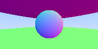
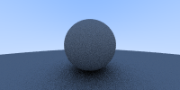

# Ray Tracing in One Weekend in Python 

> Link Followed : https://raytracing.github.io/books/RayTracingInOneWeekend.html

## Step 1:
Setting up the Python 3 project and creating my first ppm output image
* I chose to use pipenv since that's becoming a standard and it's a much easier way to maintain dependencies 
* I also wanted to learn Python3 and get comfortable with it after 3 years of Python2 experience

So here is my first image!

## Step 2:
The second step was to setup a Vector utility class that will be used by pretty much all the code moving forward
Some decisions I had to make while write this class:
* I tried to have Vector3 as a subclass of numpy.ndarray but chose to write it from scratch because it was easier
* I used a decorator for some utility functions like cross,dot and unit_vector so that I can't pass around non-vectors

## Step 3:
This taught be what a Ray class would look like since Rays over here is an essential entity to navigate
from camera to objects
* This took me some time to get my code working because I realised I head to override the _add_ _sub_ properties of the
list Vector3 class to perform any sort of operations 
* I also learnt that after overriding the methods the operator order mattered. vector x 2 worked since I had defined the method 
that way but, 2 x vector doesn't work

But yes finally got to the lerp blue image! 

## Step 4:
After a bit of Vector algebra brush-up I learnt about how to represent a sphere in a vector form and then it was pretty straightforward 

* Check if the ray is hitting the sphere: This is done by solving the quadratic `dot(p(t) - C, p(t) - C) = R*R`
* All we had to check was to see if the discriminant was positive to confirm that there is a solution 
* Once this function is written we color the pixel red instead of the gradient and we get a beautiful centre sphere 

## Step 5
The first part of this step is to generate a way to calculate and visualize the normals 
* We start by calculating the actual determinant -> use that to calculate the normal vector -> make it it's unit vector 
-> map the component values to R/G/B to visualize the normals on the sphere
* Also realised in Python3 the magic method for division should be `__truediv__` instead of just `__div__` 

* The next part of this step was to get an abstract class working to so that we can define what a `hittable` object needs
to implement. Mainly the "hit" function
* We then have a Hittable list class which allows us to define a list of "hittable" objects (in our example case -> two spheres)
* This list is then used to render out the normals for all the spheres in the scene. I went ahead and created two scenes -> one as 
explained in the tutorial and another with a sphere at +102.5 and that's how it looks. Fun! 

     

## Step 6 
Anti Aliasing! 
I took a long break before this section and so I had to read back everything I had done before to carry on the momentum

* It was straightforward to make a Camera class and abstract what was going on in the main.py into it's own
* Anti Aliasing was about averaging out the color value by sending in multiple ray for the same pixel : Thankfully the random function in Python
was doing it's job of giving me [0, 1) real numbers so that was great! 
* I got stuck at this step for a while because the += operator wasn't working because of the vec3 `_add_` override. 
I had to expand it and it worked fine. I also learnt that I could override the `__iadd__` method to make it work but I kept it this way for now
* Also : Python is acting up already with just 3 spheres and samples = 100. It takes a solid 30s for this to render, but hey it did render! 

## Step 7 
Diffuse material! 
This step was to mimic a diffuse material which basically has a color of its own and take on the color of the environment
Light can bounce off randomly at any direction after hitting the object

* Learnt the interesting and hacky Rejection method for calculate a random point inside a unit sphere
* The point of contact between two surfaces as we can see from the image is dark / shadow since it's mostly absorbed
* With a 100 samples : The image with gamma took 133.6 seconds to render (after removing the extra sphere in the scene)

    